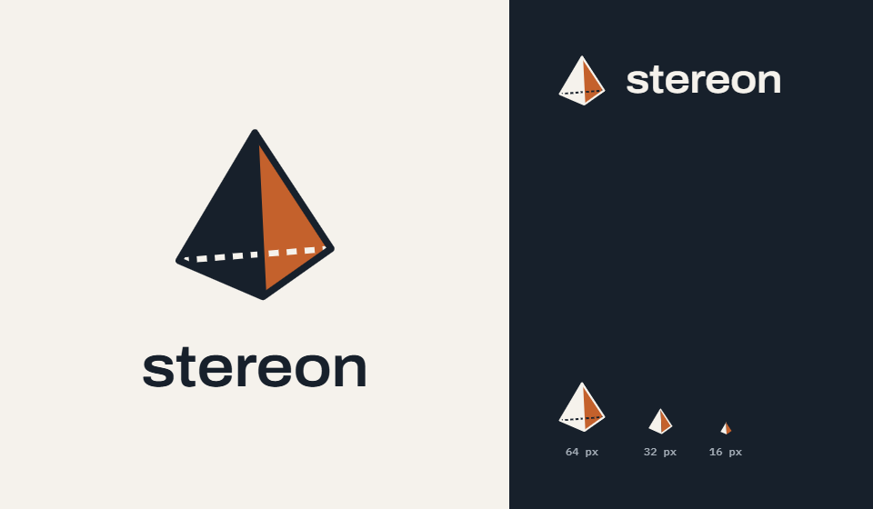

.. SPDX-FileCopyrightText: 2026 Onur Tuncer and Stereon contributors
.. SPDX-License-Identifier: MPL-2.0
..
.. This Source Code Form is subject to the terms of the Mozilla Public
.. License, v. 2.0. If a copy of the MPL was not distributed with this
.. file, You can obtain one at https://mozilla.org/MPL/2.0/.

.. _mainpage:

Stereon
=======

**A modern C++26 boundary-representation (B-rep) geometric modeling kernel.**

.. warning::

   Stereon is pre-alpha (Phase 0, foundations). This manual is a skeleton:
   most chapters are placeholders listed under *Open documentation tasks*
   below. The design decisions themselves are recorded as ADRs in
   `docs/adr <https://github.com/onurtuncer/Stereon/tree/main/docs/adr>`_.

.. toctree::
   :maxdepth: 2
   :caption: Getting started

   intro
   building
   examples

.. toctree::
   :maxdepth: 2
   :caption: Kernel guide

   architecture
   tolerances
   geometry
   topology
   intersection
   modeling
   meshing
   data_exchange
   errors

.. toctree::
   :maxdepth: 2
   :caption: Reference

   python
   api
   testing
   references

Open documentation tasks
------------------------

.. todolist::

* :ref:`genindex`
